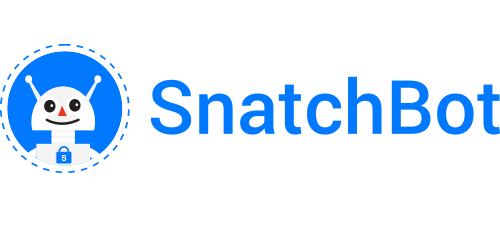

  

  <h1>SnatchBot - Mission 30Days</h1>
  
Journal of what i have learned, played, created using SnatchBot for 30 days

  
From: 01-06-2020 &nbsp;  To: 30-06-2020

   

| Day  | Task | Status |
| :-------------: | :------------- | :----------: |
| Day 1  | Introduction to SnatchBot  | Done |
| Day 2  | Address Collection Interaction  | Done |
| Day 3  | SnatchBot Creating a Bot  | Done |
| Day 4  | SnatchBot Creating a Bot Statement | Done |
| Day 5  | SnatchBot Adding Data to Google Sheet | Done |
| Day 6  | SnatchBot User Attributes | Done |
| Day 7  | SnatchBot User Attributes | Done |
| Day 8  | SnatchBot User Attributes-Webhooks | Done |
| Day 9  | SnatchBot Logical Operations | Done |
| Day 10  | SnatchBot Search Integration | Done |
| Day 11  | SnatchBot Multichannel sharing | Done |
| Day 12  | SnatchBot Testing NLP Data | Done |