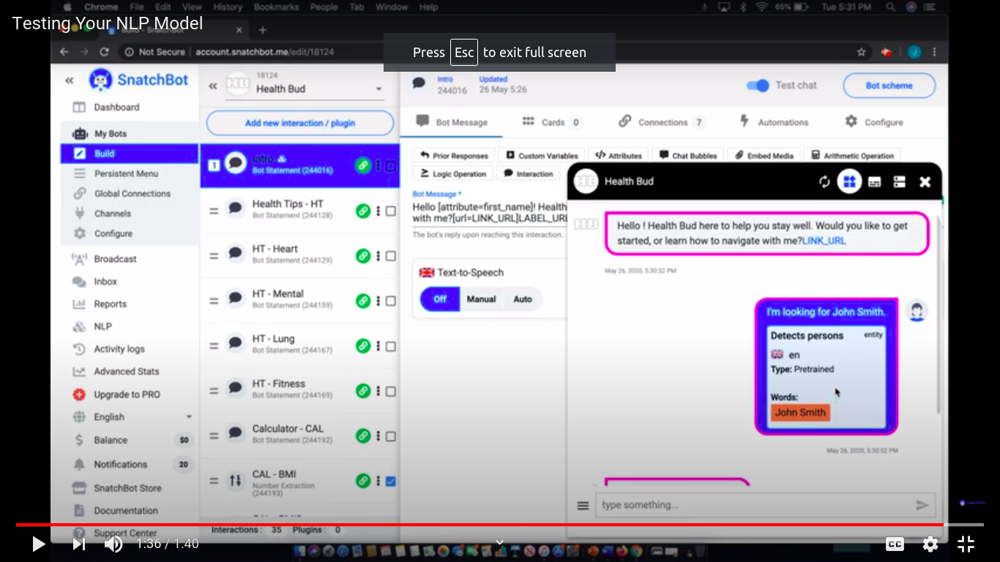

  <h1>SnatchBot - Day 12</h1>
  
SnatchBot Testing NLP Data

To test the NLP Data in SnatchBot do the below steps

1. Select your bot and click Test
2. Once the Test bot is clicked select the above icon to test the NLP model

  

Now if you see the above image you could see something like the highlighted text those are the NLP extractions.
