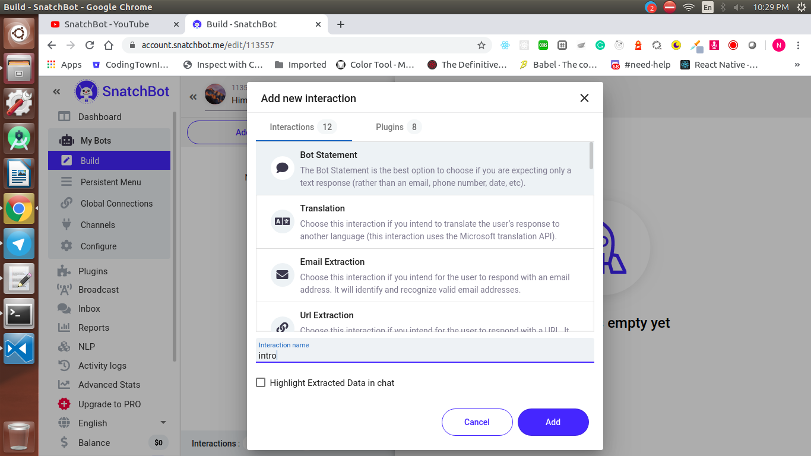
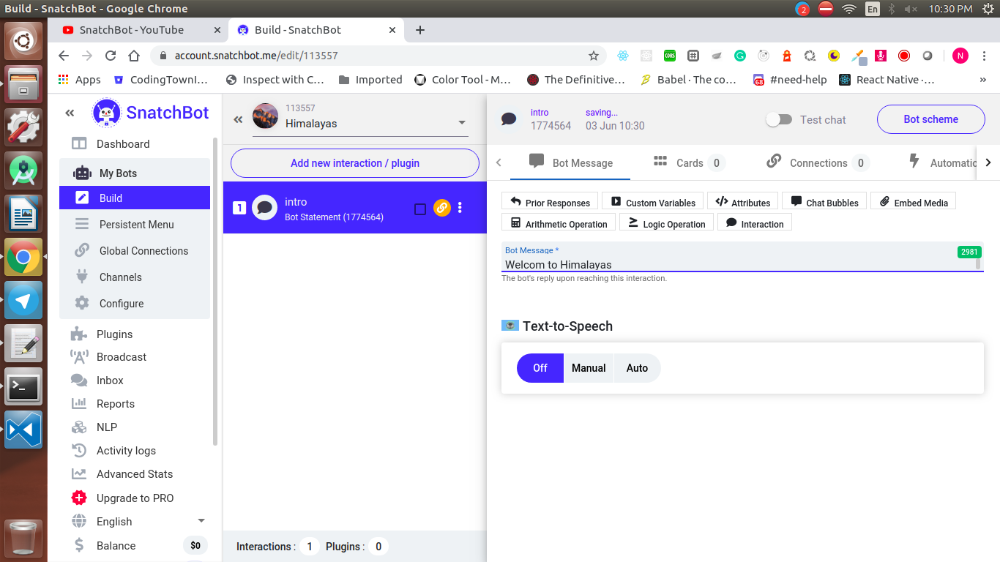
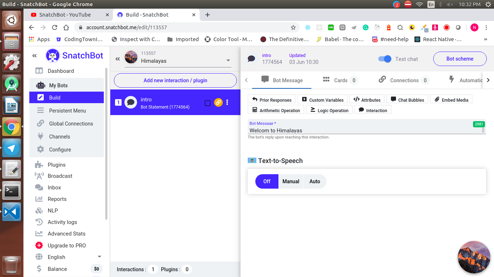
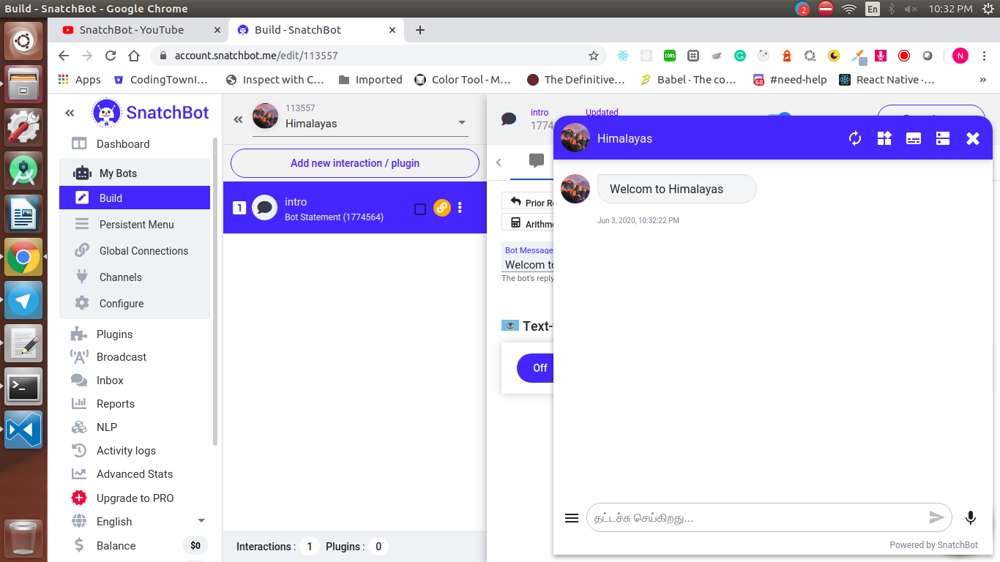

  <h1>SnatchBot - Day 3</h1>
  
SnatchBot Creating a Bot

To create a bot in snatchBot go to their website and login with the credentials and once logged in click `My Bots` and create a bot by selecting a blank bot

   

Add the bot name and description and logo and select the lanuage u need and click create

   

Now you can see the option of interactions / plugins  which is needed for the actions, Click Interactions and give a name to the interaction

   

Once the interaction is created add an message/response like below

   

Now Test this bot by enabling the test chat option and click the image like below

   

   

We have created a simple bot in SnatchBot