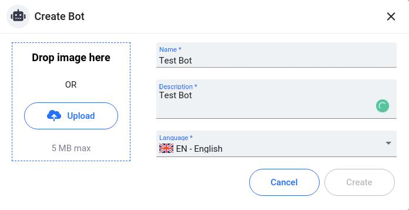
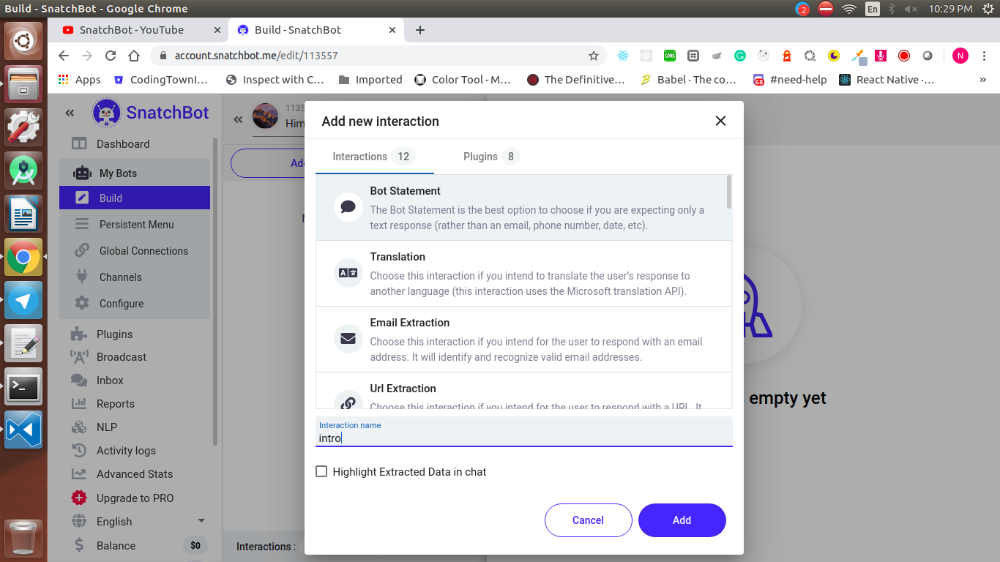
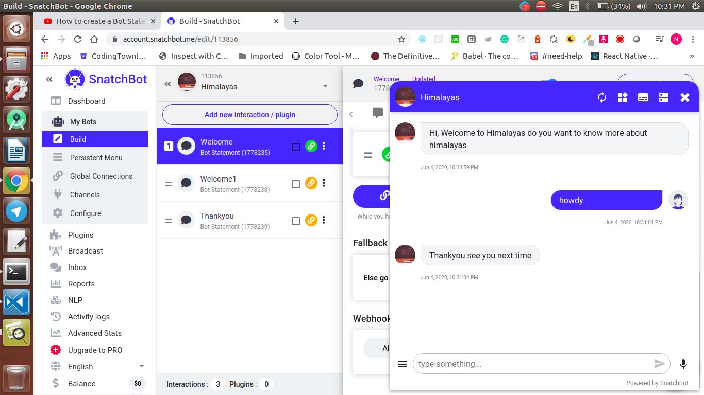

  <h1>SnatchBot - Day 4</h1>
  
SnatchBot Creating a Bot Statement

Creating a bot statement is nothing but giving the users a response when they first interact with the bot

To create a bot in snatchBot go to their website and login with the credentials and once logged in click `My Bots` and create a bot by selecting a blank bot

   

Add the bot name and description and logo and select the lanuage u need and click create

   

Now you can see the option of interactions / plugins  which is needed for the actions, Click Interactions and give a name to the interaction

   

Once the interaction is created add an message/response like below

   

Add the interaction name similar like naming an intent. Add the message for this statement like below

   

Once the message is added click `Connection` and add the next interaction like if the user says yes what should be done / Which statement should be called next

   

Similarly for the error block we will do the same here instead of match we will give the option `doesnt matches`

Once done test the bot by enabling the test chat option at top and you could see the output like below

   

Message Yes

   

Fallback

   

