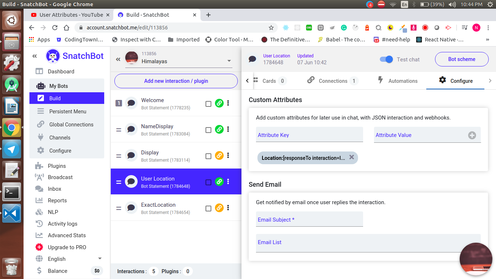
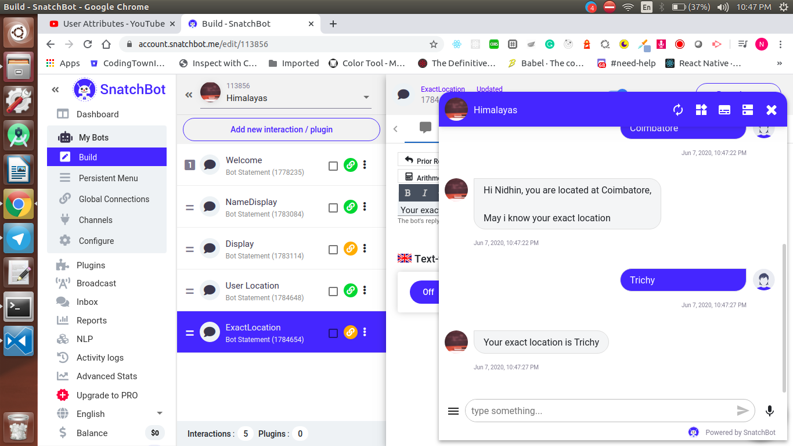

<div align="center">
  <h1>SnatchBot - Day 7</h1>
  <p>SnatchBot User Attributes</p>
</div>

In the user Attributes we can make a even cleaner approach of getting the user typed value from one intent to other like below

In the first intent click `Configure` select custom attributes and add a key and value like below

```
Location: [responseTo interaction=ID fallback=TEXT]
```

<div align="center">
   
</div>

and then the intent which is called next can show this response by just adding the following in the bot message like below

```
Your exact location is [attribute=Location]
```

Once it is done and if we run the bot we could see the output like below

<div align="center">
   
</div>