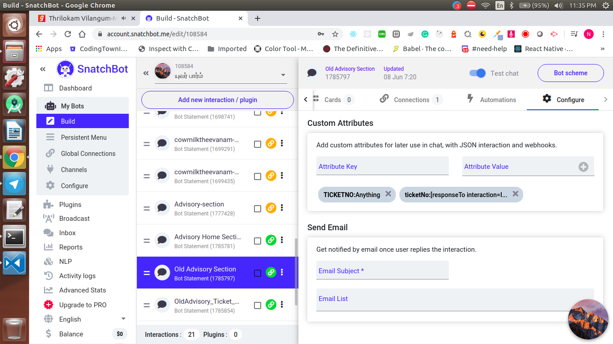
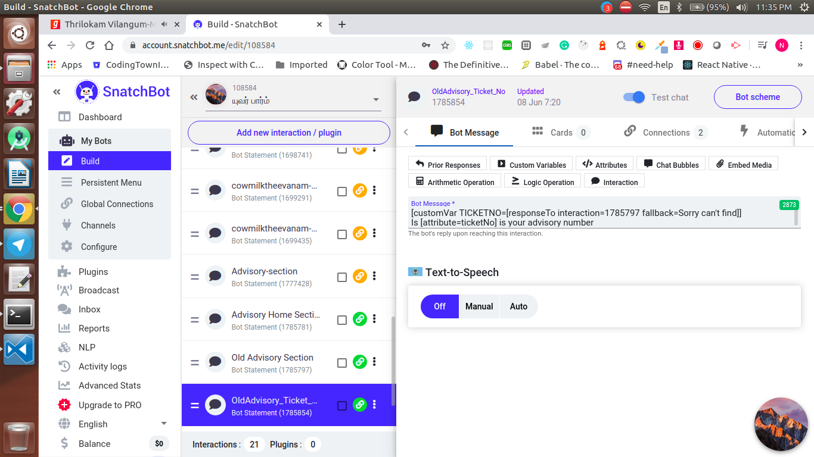
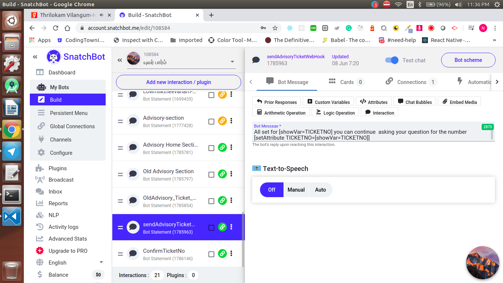

  <h1>SnatchBot - Day 8</h1>
  
SnatchBot User Attributes-Webhooks

When we take a value from the snatchbot and if we want to pass that value to our server we can do it using the webhooks

For that we should do the following steps

1. First we will set the variable like the below image

   

2. Once the variable is created we will pass the variable like below

   

3. Once done we can the show the value which is stored in the variable like below as well as we can set it to an attribute like below

   

4. Once the value is set to an attribute we can use the webhook and add the custom attribute like the below image

   

When we run the bot and pass the selected value it will passed to our webhook as an parameter inside the `VARIABLES` key

